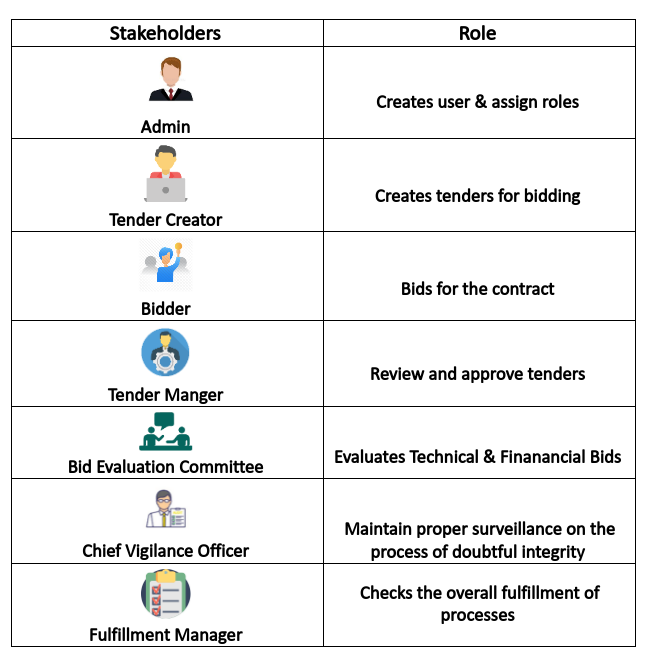
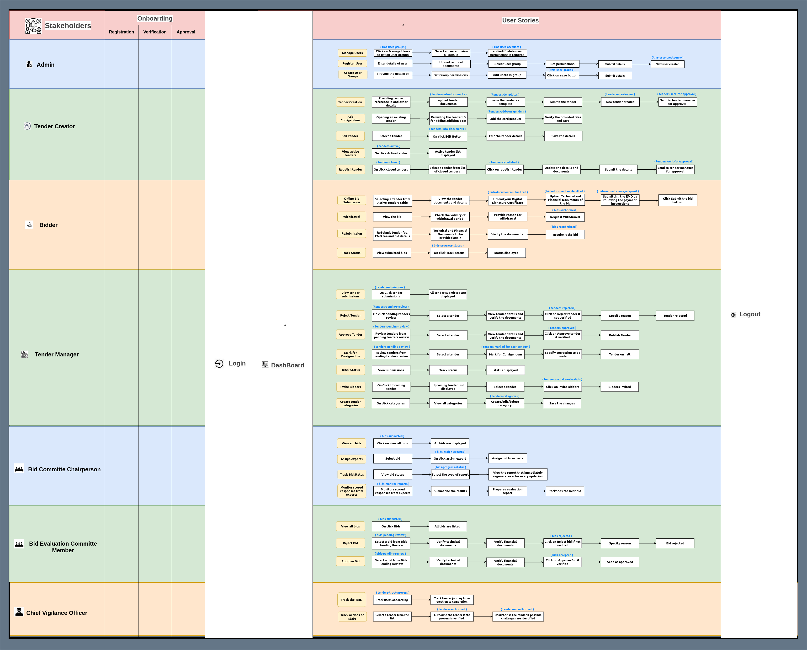
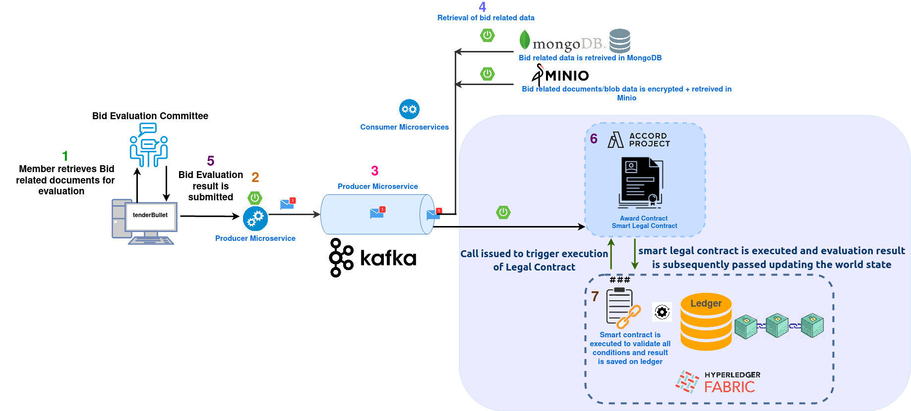
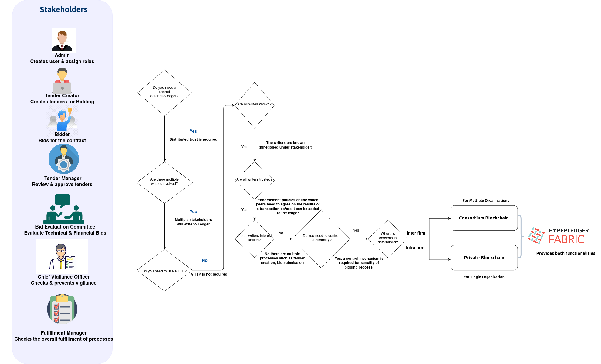

Enterprise Project
========================

# Blockchain-Implementation for Traditional Tendering Platforms
*****************************************************************

## Problem Statement 

## Stakeholders

## User Stories for each Stakeholder

## Technical Diagram

## Components

- Blockchain will be used end to end for the transactions by the stakeholders involved:
  Admin, Tender Creator, Bidder, Tender Manager, Bid Evaluation Committee, Chief Vigilance Officer/Auditor and Bank.
- Technical components include Vue.js (UI/UX Layer), SpringBoot (Backend), MongoDB (NoSQL Database),  
Kafka (messaging queue) and Hyperledger Fabric operating in the back-end while Docker making up the infrastructure layer.
- Technology stack comprises microservices, relevant smart contracts and messaging queue Kafka making a having highly scalable, fault-tolerant & decoupled architecture.

## Usecases

Bid Evalution Usecase flow

The usecase of Bid Evaluation Committe - in this scenario the committe receives the bid document which is highly confidential, 
thus members of the committe need to submit a non-disclosure agreement.This legal contract is generated via Accord project. 
The contract is submitted to the chaincode container which eventually runs on the ledger.The blockchain-based business network on
the Hyperledger Fabric invokes Accord Project components to execute Smart Legal Contracts.

Similarly, once winning bidder is shortlisted via evaluation the Award Contract can be generated by the Cicero and logical 
smart legal functionality can be added by Ergo. Eventually, chaincode will be triggered and transactions will be saved on 
the fabric ledger.

## Blockchain Selection 

